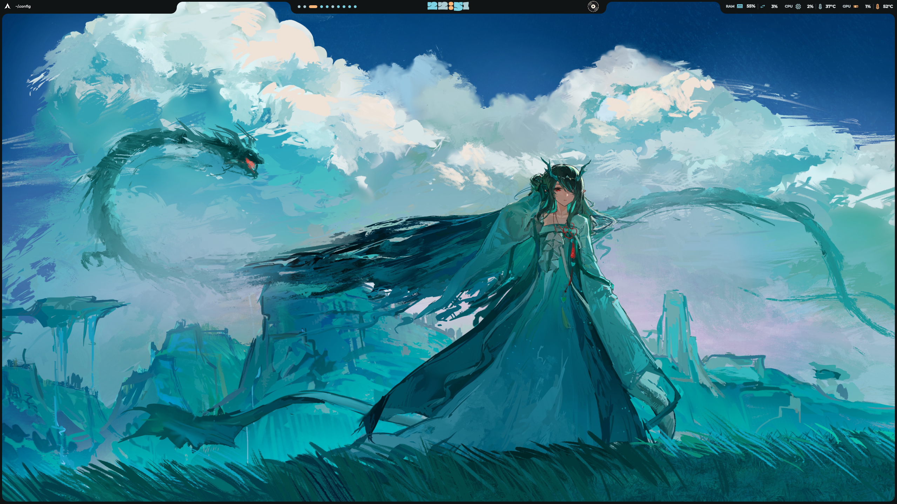

<div align="center">

# ✦ GraSo-Shell

### A minimal, dynamic and cohesive Hyprland setup.

Personal dotfiles built around **Hyprland**, **Quickshell** and **Matugen**.

<p>
  
  
  
  
</p>

</div>

---

## ✦ Showcase

<!-- Replace these with your own screenshots -->

<p align="center">
  
</p>

<!--
<p align="center">
  
  
</p>
-->

---

## ✦ About

A personal desktop configuration focused on a clean workflow, consistent
theming and minimal visual clutter.

The setup is based around **Hyprland** with a **Quickshell** interface and
dynamic colors generated from the current wallpaper using **Matugen**.

These dotfiles are primarily made for my own system, but feel free to use,
modify or take inspiration from them.

---

## ✦ Components

| | Component |
| --- | --- |
| **Compositor** | Hyprland |
| **Shell** | Quickshell |
| **Launcher** | rofi |
| **Terminal** | Kitty |
| **Shell** | Fish |
| **Prompt** | Starship |
| **File Manager** | Yazi | Dolphin |
| **Colors** | Matugen |
| **GTK** | GTK 3 / GTK 4 |
| **Qt** | Qt5ct / Qt6ct |
| **Qt Theme** | Kvantum |
| **Visualizer** | Cava |
| **System Monitor** | btop |
| **Media** | mpv |
| **Audio** | EasyEffects |
| **Editor** | Warp |

---

## ✦ Installation

> [!WARNING]
> These dotfiles are configured for my personal setup.
> Review the files before installing them on your system.

Clone the repository:

```bash
git clone https://github.com/<user>/<repo>.git ~/dotfiles
```

Backup your current configuration:

```bash
cp -r ~/.config ~/.config.backup
```

Then copy or symlink the configurations you want to use.

Example:

```bash
ln -s ~/dotfiles/hypr ~/.config/hypr
ln -s ~/dotfiles/quickshell ~/.config/quickshell
ln -s ~/dotfiles/fish ~/.config/fish
```

---

## ✦ Dotfiles tracking

This repository intentionally does **not** track the entirety of
`~/.config`.

The `.gitignore` works as an allowlist:

```gitignore
/*
!.gitignore

!/hypr/
!/quickshell/
!/fish/
!/ghostty/
!/kitty/
```

This prevents application state, databases, caches and other generated
files from accidentally ending up in the repository.

---

## ✦ Notes

Some parts of the configuration may be machine-specific, especially:

- Monitor configuration
- Audio devices
- Hardware peripherals
- Display scaling
- Paths
- Systemd user services

You may need to adjust them for your system.

---

## ✦ Credits

Built with and inspired by the Linux ricing community.

Special thanks to the developers and contributors behind:

- [Hyprland](https://hypr.land/)
- [Quickshell](https://quickshell.org/)
- [Matugen](https://github.com/InioX/matugen)
- [Fish](https://fishshell.com/)
- [Starship](https://starship.rs/)
- [Yazi](https://yazi-rs.github.io/)

And the many dotfile projects that continue to push the Linux desktop
forward.

---

<div align="center">

### ✦ made for my own little corner of linux

</div>

